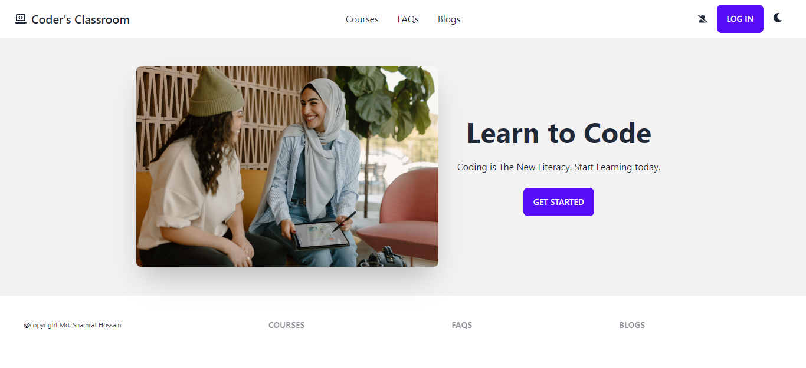
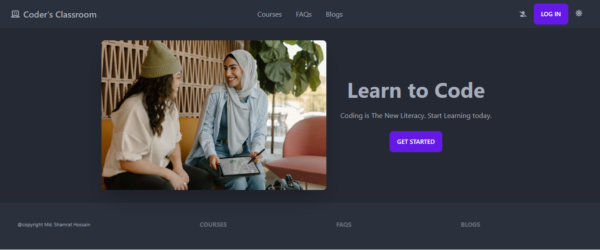

# CODER'S CLASSROOM

## Table of contents

- [Overview](#overview)
  - [Screenshot](#screenshot)
  - [Links](#links)
- [Built with](#built-with)
- [Author](#author)

## Overview

This is a full stack demo project. I worked on both server and client side here. Added authentication with email, password Google & Github. 

### Screenshot

### Links

- [Solution Client side](https://github.com/programming-hero-web-course1/b610-learning-platform-client-side-shamratPG)
- [Solution Server side](https://github.com/programming-hero-web-course1/b610-lerning-platform-server-side-shamratPG)

- [Live Site](https://coders-classroom-5ae3d.web.app/)

## Built with

- React
- Express
- Tailwind CSS
- Daisy UI
- FireBase
- React Router
- React to PDF
- Theme Change

## Author

- Website - [Md. Shamrat Hossain](https://github.com/shamratPG)
- Twitter - [@shamratpg](https://twitter.com/shamratpg)

